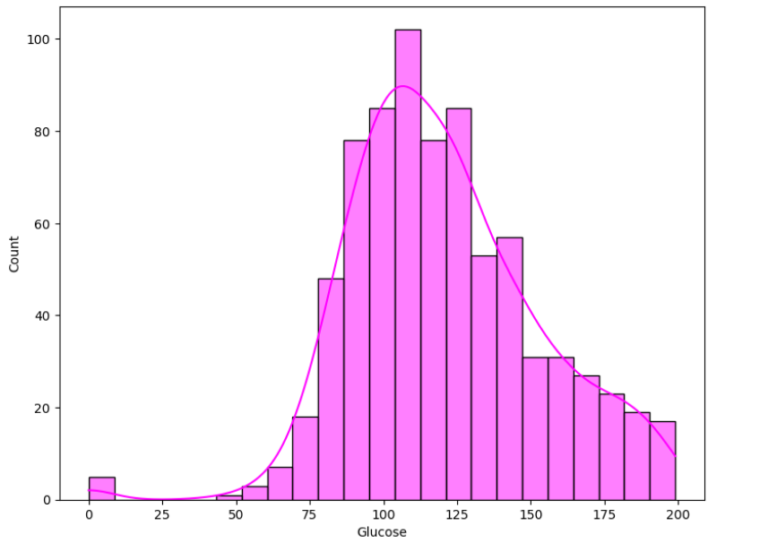
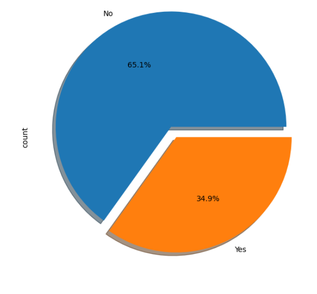
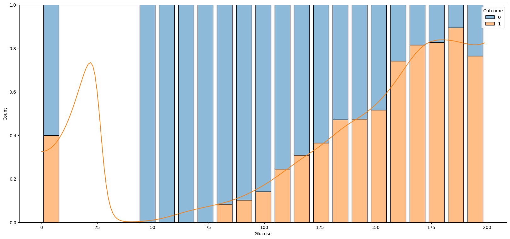
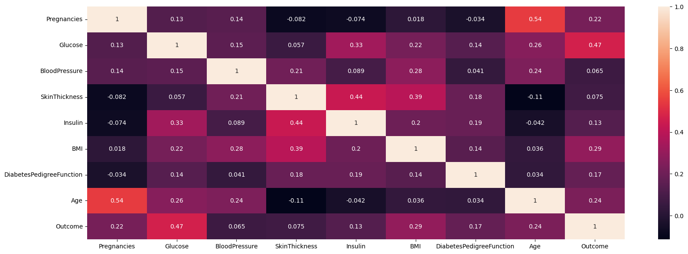
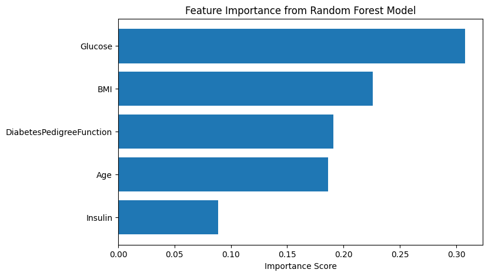

# Diabetes Prediction Using Machine Learning | Mentormind Project

This project was developed as part of the **Mentormind Data Science Program** and focuses on predicting the **onset of diabetes** using diagnostic and physiological data.  
The project applies **Exploratory Data Analysis (EDA)**, **baseline machine learning models**, and **feature engineering** to build and evaluate classification models that can assist in early diabetes risk detection.

---

## 📊 Sample Visualizations

> 📌 Key insights generated during Exploratory Data Analysis and modeling

---

## 📂 Dataset Description

- **Dataset Name:** Pima Indians Diabetes Dataset  
- **Dataset Type:** Structured medical diagnostic data  
- **Target Variable:**  
  - `Outcome`  
    - `1` → Diabetic  
    - `0` → Non-Diabetic  

### Features Used
- Glucose  
- BloodPressure  
- SkinThickness  
- Insulin  
- BMI  
- DiabetesPedigreeFunction  
- Age  

Dataset file:
- `diabetes.csv`

---

## 🛠 Tools & Technologies

| Tool / Library | Purpose |
|---------------|--------|
| **Python** | Core programming |
| **Pandas, NumPy** | Data manipulation |
| **Matplotlib, Seaborn** | Data visualization |
| **Scikit-learn** | Machine learning models |
| **Jupyter Notebook** | Analysis & experimentation |

---

## 🔄 Project Workflow

1. **Data Understanding & EDA**
   - Dataset inspection and summary statistics
   - Identification of zero values in medical attributes
   - Univariate and multivariate analysis

2. **Baseline Model Development**
   - Train-test split (80:20)
   - Implemented baseline classifiers

3. **Feature Engineering**
   - Feature scaling (MinMaxScaler, StandardScaler)
   - Feature selection based on correlation and importance
   - Outlier removal using IQR method

4. **Model Training & Evaluation**
   - Retrained models on cleaned and engineered data
   - Compared model performance using accuracy

---

## 📈 Model Performance Comparison

| Model | Accuracy |
|------|----------|
| Logistic Regression | 0.7467 |
| K-Nearest Neighbors (KNN) | 0.6623 |
| Decision Tree | 0.7467 |
| Random Forest | 0.7208 |

> Logistic Regression and Decision Tree achieved the highest accuracy, while Random Forest showed strong feature interpretability and robustness.

---

## 🔍 Key Insights

- **Glucose** is the most influential predictor of diabetes
- **BMI and Age** significantly impact diabetes risk
- Feature engineering improves model stability and performance
- Ensemble and tree-based models handle non-linear patterns effectively

---

## 🧠 Business & Healthcare Impact

- Early diabetes risk identification can support **preventive healthcare**
- Data-driven screening helps reduce reliance on subjective diagnosis
- Predictive models can assist clinicians in prioritizing high-risk patients

---

## 📦 Project Files

- `Eda,Baseline_models,Feature_engineering.ipynb` – Main notebook  
- `diabetes.csv` – Dataset  
- `Predicting the Onset of Diabetes Based on Diagnostic Data.pdf` – Project report  
- `images/` – EDA and model visualizations  
- `README.md` – Project documentation  

---

## 🚀 Future Enhancements

- Handle class imbalance using **SMOTE**
- Apply **hyperparameter tuning (GridSearchCV)**
- Add **cross-validation**
- Deploy model using **Streamlit / Flask**
- Integrate with healthcare dashboards

---

⭐ If you find this project useful, feel free to **star the repository**!
